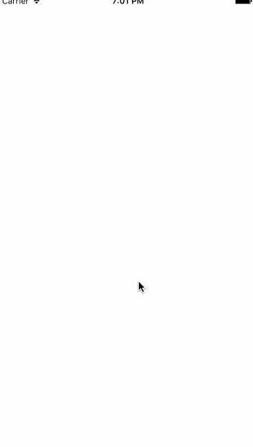
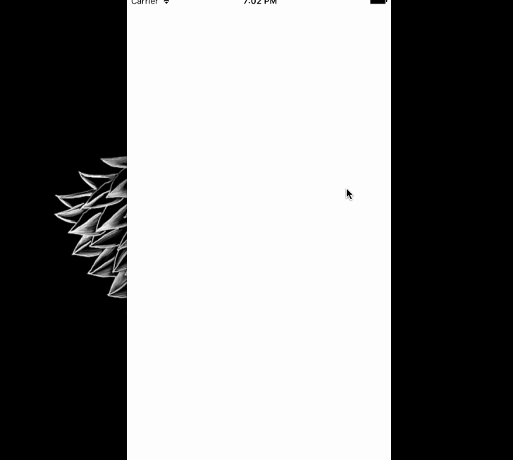

# ActionSheetController
ActionSheetController is an UIAlertController's APIs like ActionSheet control

### How does it look like?

<p align="left">
&nbsp;
</p>

### How to use

```swift
let controller = ActionSheetController(cancelTitleColor: UIColor.blueColor())

let titles = ["发送给胖友", "收藏", "保存图片", "定位到聊天位置", "分享到微博", "复制链接", "复制图片"]
titles.forEach { (title) -> () in
    let action = SheetAction(title: title, handler: { (sender: SheetAction) -> Void in
        debugPrint("Taped: \(sender.title)")
    })
    controller.addAction(action)
}

let action = SheetAction(title: "Plus", titleColor: UIColor.redColor())
controller.addAction(action)

presentViewController(controller, animated: true, completion: nil)
```

### Notice

-   v0.x for swift 2.2
-   v1.x for swift2.3
-   v2.x for swift3.x
-   v3.x for swift4.x
